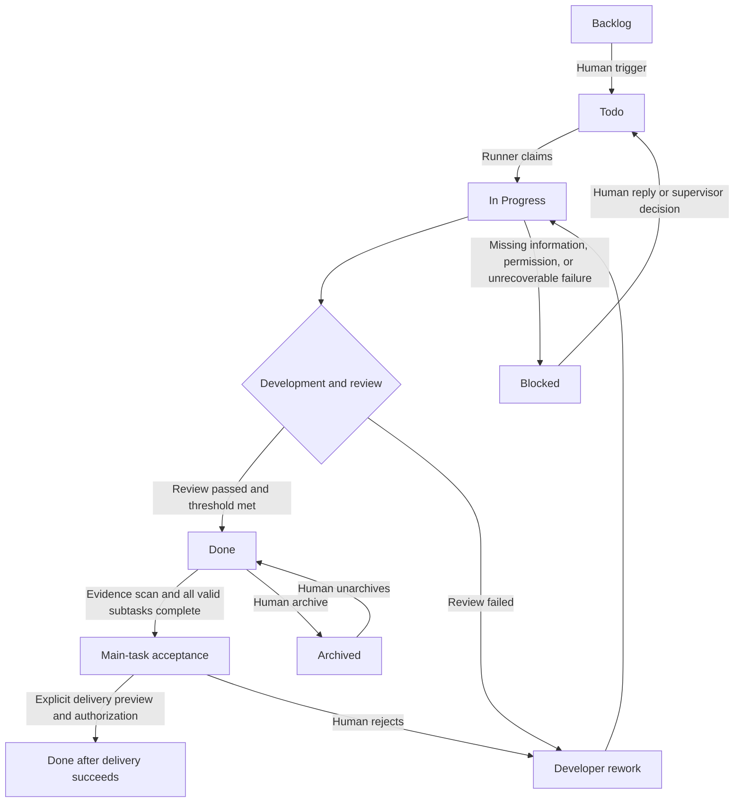
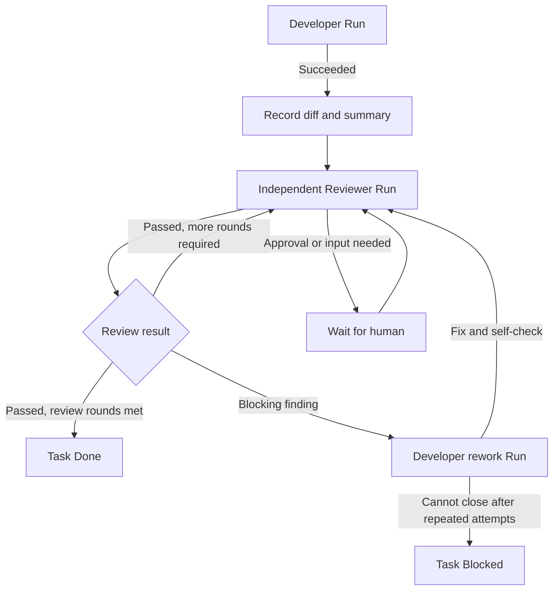

# OpenWorkshop

**English** | [简体中文](README.zh-CN.md)

> As the client, you only need to tell an AI Agent what you need; OpenWorkshop then works like a professional software company—clarifying requirements, breaking down tasks, building, reviewing, and delivering an acceptance-ready result.

OpenWorkshop organizes existing local codebases, dedicated Codex Agent roles, and human decisions into a traceable engineering workflow. You set the objective, approve requirements, and accept the result; the system assembles context, breaks work into tasks, schedules Agents, records execution, and archives delivery documents.

It provides both a web workbench and a structured CLI. People can inspect projects and intervene from the browser, while Codex and other Agent apps can control the same workflow through the CLI.

## Why OpenWorkshop

- **Data ownership**: Code, the SQLite database, attachments, and run records stay on your own machine, without an external project management service.
- **Requirements first**: An Agent clarifies scope and acceptance criteria before planning or development begins, and execution starts only after human approval.
- **Dedicated roles**: Requirements analysis, task planning, development, testing/review, project coordination, and document archiving are handled by separate roles.
- **Visible execution**: Inspect Agent messages, tool calls, commands, file changes, approval requests, and acceptance evidence in real time.
- **Human in the loop**: High-risk operations, requirement versions, and final delivery retain explicit human decision points.
- **Agent-ready**: The CLI offers stable JSON input and output for orchestrating the full workflow from Codex and other Agent apps.

## How It Works

```text
Connect a local project
    ↓
Submit a request with text and attachments
    ↓
Requirements Agent clarifies it and drafts the requirement
    ↓
Human approves the requirement
    ↓
Planning Agent creates the task tree and dependencies
    ↓
Development Agents implement; testing/review Agents verify independently
    ↓
Human accepts the main task
    ↓
Archive requirements, plans, reviews, and delivery documents
```

OpenWorkshop recognizes Git, SVN, and projects without version control. Git write tasks can use isolated worktrees; SVN and unversioned projects serialize writes to avoid concurrent changes in the same working directory.

### Task Progression Model



The main task coordinates its dependency tree, while a directly triggered subtask only authorizes that task and its unfinished prerequisites. A main task cannot enter `Done` before human acceptance; a blocked subtask keeps the main task in `Todo` until it is recovered or otherwise resolved.

### Execution and Review Flow



Each review reads the acceptance criteria, current requirement version, development summary, file changes, and project verification constraints. Rework runs do not count toward successful review rounds; the default is two successful independent review rounds.

## Features

### Projects and Requests

- Configure allowed local roots and prevent path or symbolic-link traversal.
- Connect existing projects and analyze their stack, version control, `AGENTS.md`, and common verification commands without modifying the project.
- Submit independent requests with text, images, Markdown, TXT, PDF, or DOCX attachments.
- Keep multiple requests and their requirements, tasks, and delivery records in the same project.

### Requirements and Planning

- Let the Requirements Agent ask about goals, scope, constraints, and missing information over multiple rounds.
- Generate versioned requirement documents and acceptance criteria without silently overwriting approved requirements.
- Create a main task, arbitrarily nested subtasks, and a dependency graph after approval.
- Support priorities, assignees, labels, due dates, read-only tasks, and human waivers.

### Agent Execution

- Start independent Runs through the local `codex app-server` without storing an OpenAI API key.
- Let the Scheduler select runnable tasks based on dependencies, approvals, concurrency limits, and project locks.
- Steer, pause, resume, or cancel active Runs, and answer Agent questions.
- Record approvals for commands, file changes, permissions, and high-risk operations.
- Verify completed development with an independent testing/review Agent, returning failures for rework or blocking.

### Acceptance and Archiving

- Combine task state, Runs, review results, and evidence into a final acceptance view.
- Close the main task and request after human approval, or return rejected work for rework.
- Generate requirements, plans, review reports, and delivery documents while retaining their history.
- Deliver Windows system notifications directly from the background service, with browser notifications as a fallback on other platforms or after delivery failure; database backup/restore and log retention are also included.

## Quick Start

### Requirements

- macOS or Windows
- Node.js 24+
- Codex CLI installed and signed in
- Optional: Git or SVN for project detection and isolation

### Install and Start

Start and open the workbench in one command without a global install:

```bash
npx openworkshop gui
```

For a global installation from npm:

```bash
npm install -g openworkshop
workshop skill install --agent codex
workshop start
workshop gui
```

To install from source and link the CLI:

```bash
npm install
npm run build
npm link --workspace @workshop/server
workshop skill install --agent codex
workshop start
workshop gui
```

`npm install -g openworkshop` installs the `workshop` command globally. Run `workshop update` later to execute `npm update --global openworkshop`. A source installation uses `npm link --workspace @workshop/server` to expose the workspace CLI under the same command. `workshop skill install --agent codex` installs the bundled Skill in Codex's personal `$HOME/.agents/skills/workshop` directory; `codex` is the default agent, an existing directory is preserved, and `--force` updates it. After installation, invoke `$workshop` explicitly in Codex or let matching Workshop workflow requests trigger it automatically. `start` launches the service in the background at `http://127.0.0.1:8787` by default. If the service is not running, `gui` starts it in the background before opening the workbench in the system browser. On first visit, follow the page prompt to set a six-digit PIN and configure allowed project roots.

Run in the foreground or allow LAN access:

```bash
workshop start --foreground
workshop restart --host 0.0.0.0 --port 8787
```

The PIN provides basic access control for a trusted local network; it is not internet-grade authentication. Do not expose the service directly to the public internet.

## Drive Workflows from the CLI

These examples use the `workshop` command installed on `PATH` in Quick Start. Without a link, replace it with `node apps/server/dist/cli.js`.

Sign in and verify the runtime first:

```bash
workshop login
workshop status --output json
workshop runtime codex-health --output json
```

Create a request and advance its requirements:

```bash
workshop project list --output json

workshop commission create <project-id> \
  --data '{"title":"Add export","message":"Export the project report as Markdown."}' \
  --output json

workshop commission analyze <commission-id> --output json
workshop commission message <commission-id> \
  --data '{"content":"Export only the current request, including tasks and review results."}' \
  --output json
workshop requirement approve <requirement-id> --output json
```

Trigger execution and handle approvals:

```bash
workshop task list <project-id> \
  --query '{"commissionId":"<commission-id>","view":"tree"}' \
  --output json
workshop task get-number <project-id> <task-number> --output json
workshop task delete <task-id> --data '{"reason":"Duplicate task"}' --output json

workshop task trigger <task-id> --output json
workshop task runs <task-id> --output json
workshop run events <run-id> --query '{"after":"0"}' --output json

workshop approval list \
  --query '{"status":"pending","runId":"<run-id>"}' \
  --output json
workshop approval decide <approval-id> \
  --data '{"decision":"accepted"}' \
  --output json
```

Inspect acceptance, choose an explicit delivery method, and read delivery documents:

```bash
workshop task acceptance <main-task-id> --output json
workshop task delivery-preview <main-task-id> --data-file preview.json --output json
workshop task deliver <main-task-id> --data-file delivery.json --output json
workshop delivery get <delivery-id> --output json
workshop delivery retry <delivery-id> --output json
workshop delivery cancel <delivery-id> --output json

workshop document list <project-id> \
  --query '{"commissionId":"<commission-id>","type":"delivery"}' \
  --output json
```

`preview.json` contains the selected method and method-specific options. For example:

```json
{"method":"document"}
```

Run `task delivery-preview` first, then copy its top-level `fingerprint` into a new `delivery.json` alongside the same request:

```json
{"method":"document","previewFingerprint":"<fingerprint-from-preview-output>"}
```

Use `vcs_commit` or `github_pr` with the optional commit, remote, branch, or PR fields supported by that method in both files. `task deliver` returns the Delivery ID and current state immediately; poll with `delivery get` instead of waiting for the background worker. The old parameterless `task accept` command is intentionally unavailable.

Codex and other Agents can bypass Workshop's requirements clarification and Planning Agent by directly importing a requirement and task plan that the user has already approved:

```bash
workshop requirement create-approved <commission-id> \
  --data-file requirement.json \
  --output json

workshop task create <commission-id> \
  --data-file plan.json \
  --output json
```

This path requires `requirement.json` to contain `contentMarkdown` and `acceptanceCriteria`, and `plan.json` to contain `mainTask` and `tasks`. `create-approved` immediately records the requirement as approved, so use it only when the user explicitly asks to skip clarification and has confirmed the requirement. Creating tasks does not trigger execution automatically.

CLI resources are grouped into `root`, `project`, `commission`, `requirement`, `task`, `run`, `approval`, `document`, `notification`, and `runtime`. List available actions with:

```bash
workshop --help
workshop task help
workshop run help
```

Writes accept JSON through `--data` or `--data-file`; queries accept `--query` or `--query-file`. Agents should use `--output json`. In PowerShell, prefer JSON files to avoid native command-line escaping differences:

```powershell
@{ commissionId = "<commission-id>"; view = "tree" } | ConvertTo-Json -Compress | Set-Content -Encoding utf8 query.json
workshop task list <project-id> --query-file query.json --output json
```

Use the generic API entry point for operations without a dedicated command:

```bash
workshop api GET /api/health --output json
```

Set a remote service with `--server-url` or `WORKSHOP_SERVER_URL`. The CLI binds local sessions to the service origin.

## Service Management

| Command | Purpose |
| --- | --- |
| `workshop start` | Start the service in the background |
| `workshop start --foreground` | Start the service in the foreground |
| `workshop status` | Show the process and listening address |
| `workshop gui` | Start the service in the background if needed, then open the workbench in the default browser |
| `workshop log [-n 100]` | Print the latest lines from the service log |
| `workshop restart` | Gracefully restart the service |
| `workshop stop` | Gracefully stop the service |
| `workshop doctor` | Check the database, project roots, Git, Codex, and port; missing Git is a warning, and the current OpenWorkshop listener is accepted |
| `workshop backup [path]` | Back up the SQLite database |
| `workshop restore <path>` | Restore the database after backing up the current database |
| `workshop pin set` | Change the PIN and revoke active sessions |
| `workshop update` | Run `npm update --global openworkshop` |

Override the application data directory with `WORKSHOP_HOME`. By default it contains the SQLite database, attachments, logs, backups, and runtime state. Each project's `.openworkshop` directory stores only temporary Run context.

## Current Scope

OpenWorkshop is currently an MVP for a single personal user on a trusted local network:

- Only Codex CLI is supported; third-party Agent runtimes are not configurable.
- Existing local directories are connected; OpenWorkshop does not clone remote repositories.
- Git commits, pushes, pull requests, and SVN commits are never performed automatically.
- The web UI targets desktop browsers and is currently available in Simplified Chinese.
- The service, Runner, SQLite database, and project directories run on the same host.

These boundaries keep execution controllable and auditable while validating the complete software delivery loop first.

## Architecture

```text
Web Workbench / Workshop CLI
             │
        Fastify Server
        ├── REST + SSE
        ├── SQLite Store
        ├── Scheduler
        ├── Project Scanner
        ├── Document Service
        └── Codex Runner
                 │
          codex app-server
                 │
          Local Project / Git Worktree
```

Core technologies: Node.js, TypeScript, Fastify, Next.js, SQLite, and Codex App Server. The Server, Scheduler, and Runner remain a single process, avoiding message queues, Redis, external databases, and microservice operations for a local MVP.

## Development Validation

```bash
npm test
```
